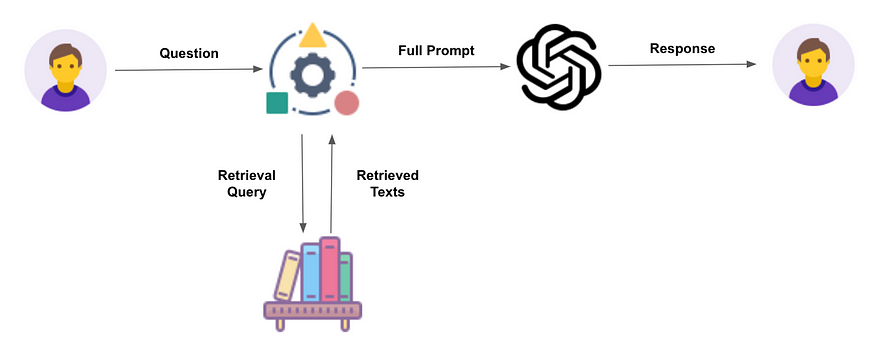

# Azure OpenAI and Congintive service

- [Azure OpenAI 서비스](#azure-openai-서비스)
- [RAG](#retrieval-augmented-generation)
- [Azure cognitive search](#azure-congnitive-search)
- [RAG에 사용되는 기술](#rag에-사용되는-기술)
- [기업데이터와 연결을 위한 RAG 아키텍쳐](#기업데이터와-연결을-위한-rag-아키텍쳐)
- [데모 프로젝트 돌려보기](#데모-프로젝트-돌려보기)

## Azure OpenAI 서비스
Applied AI serviced에는 `Azure AI Bot Service`, `Azure AI Cognitive Search`, `Form Recognizer`, `Azure AI Video Indexer`등이 있으며 이러한 서비스와 아울러 customizable AI Models 등과 함께 구성하여 AI 서비스를 개발 할 수 있다.

## Retrieval Augmented Generation
RAG는 사내 많은 지식을 검색하고 검색 결과 기반으로 답변을 할 수 있는 기술로 knowledge mining 이라고도 한다. 아래 그림과 같이 prompt가 발생하면 LLM이 search하고 prompt에 추가하여 full prompt한 결과를 응답하는 구조이다.

## Azure Congnitive Search
Azure cognitive 서치 서비스는 다음과 같은 구조로 동작한다.

- 사용자가 질문 전달
- 질문에대한 쿼리를 검색엔진에 주입
- Azure congnitive search가 다양한 데이터 소스에서 정보를 인덱싱하고 검색 및 추출
- 추출된 검색 결과를 프롬프트에 입력(full prompt)하고 openai에 입력
- 추출 데이터 기반으로 답변 생성

아래 그림은 full prompt에 대한 그림이다. 우선 시스템 프롬프트 메시지가 삽입되고, Cognitive search 서비스가 추출한 데이터를 삽입되어 사용자 질문이 전달된다.

즉, 사용자 질문이 바로 전달되는 것이 아니라 질문에 관련한 데이터를 탐색하여 해당 내용을 prompt에 추가하여 LLM에 전달 후 답변을 만들어 내는 방식이다.

## RAG에 사용되는 기술
- Embedding 기반 검색
- Semantic ranking
- Document chunking 
    - 한 파일당 한글 기준 500자 권장
    - readable test가 아닌 경우 form recognizer 이용해서 text추출 가능
- Summarization
    - Document chunk 단위의 길이를 줄여 cognitive seaarch가 도출한 프롬프트 결과를 간략히 요약
    - chunk 길이 축소로 토큰 제약 극복

## 기업데이터와 연결을 위한 RAG 아키텍쳐

- 사내 문서가 chunking되어 embedding 된다.
- readable하지 못하는 문서는 form recognizer에 의해 text를 추출한 후 embedding한다.
- embedding 서버는 주입되는 text에 대해 토큰화 하고 벡터 데이터를 만든다.
- 사용자가 문의한 프롬프트를 임베딩 벡터에서 유사도 검색하여 가장 유사한 데이터를 prompt에 추가하여 LLM에 문의한다.
- LLM은 응답 결과를 자연어로 답변한다.

## 데모 프로젝트 돌려보기
Azure에서 공식으로 제공하는 데모를 실행해 볼 수있다. 

**Prerequisites**

*Refer to: https://github.com/Azure-Samples/azure-search-openai-demo#readme*

위에서 설명한 Azure cognitive search에 관한 데모를 진행하기 위해 아래와 같은 설정이 필요하다. 

- [Azure 개발자 CLI](https://learn.microsoft.com/ko-kr/azure/developer/azure-developer-cli/install-azd?tabs=winget-windows%2Cbrew-mac%2Cscript-linux&pivots=os-windows)
- [Python 3](https://www.python.org/downloads/)
- [Node.js](https://nodejs.org/en/download/)
- [Git](https://git-scm.com/downloads)
- [Powershell](https://github.com/powershell/powershell), 버전 7이상이 필요함

**데모 진행 순서**

- 새 폴더를 만들고 PS터미널에서 해당 폴더로 이동
- PS터미널에서 `azd auth login` 명령으로 Azure login 수행
- `azd init -t azure-search-openai-demo` 실행하여 템플릿코드를 다운로드 및 프로젝트 이름 설정 (See [Github codesapce]( https://github.com/codespaces/new?hide_repo_select=true&ref=main&repo=599293758&machine=standardLinux32gb&devcontainer_path=.devcontainer%2Fdevcontainer.json&location=WestUs2))

- `azd up`실행하여 subscription, region 선택 등을 진행한 후 서비스를 패키징한다. 응용 프로그램이 성공적으로 배포 되면 URL이 콘솔에 프린트된다.