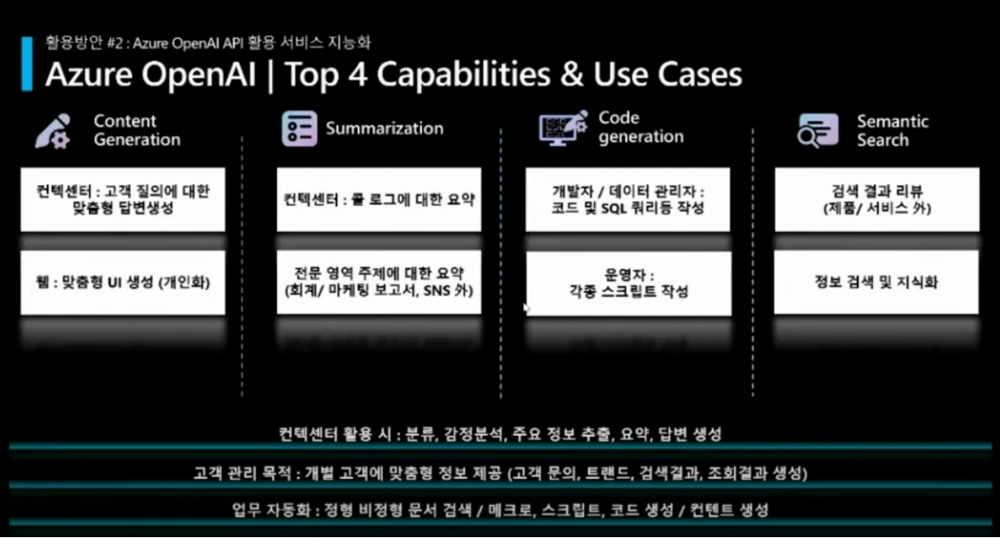

# Azure OpenAI

**목차**
- [Azuer OpenAI 서비스](#azure-openai-서비스)
- [Azure OpenAI 활용사례](#azure-openai-활용사례)
- [Azure OpenAI 모델](#azure-openai-모델)
- [Azure 구독 및 OpenAI 엑세스 권한 신청](#azure-구독-및-openai-엑세스-권한-신청)
- [Azure OpenAI studio 사용하기](#azure-openai-studio-사용하기)
- [Prompt engineering을 위한 best practice](#prompt-engineering을-위한-best-practices)

## Azure OpenAI 서비스
Azure OpenAI Service는 GPT-4, GPT-4 Turbo with Vision, GPT-3.5-Turbo 및 Embeddings 모델 시리즈를 포함하여 OpenAI의 강력한 언어 모델에 대한 REST API 액세스를 제공하며 좀 더 자세한 사항은 [Azure OpenAI서비스](https://learn.microsoft.com/ko-kr/azure/ai-services/openai/overview) 를 참조한다.

## Azure OpenAI 활용사례

다음고 같이 크게 content generation, summarization, code generation 및 semantic search 분야에 활용되고 있다.



다양한 사례 연구를 위해 [https://www.microsoft.com/ko-kr/ai/ai-customer-stories](https://www.microsoft.com/ko-kr/ai/ai-customer-stories)를 검토한다.

## Azure OpenAI 모델
Azure OpenAI 서비스는 다양한 기능과 가격대를 갖춘 다양한 모델 집합으로 구동됩니다. 모델 가용성은 지역에 따라 다르며 좀 더 구체적인 내용은 [Azure OpenAI 서비스 모델](https://learn.microsoft.com/ko-kr/azure/ai-services/openai/concepts/models)을 참조한다.

## Azure 구독 및 OpenAI 엑세스 권한 신청
Azure OpenAI를 사용하기 위해서는 Azure 구독이 필요하다. 구독이 없는 경우에는 [여기](https://azure.microsoft.com/ko-kr/free/ai-services/)를 참고한다. Azure OpenAI 리소스를 만들기 위해서는 이 서비스에 대한 엑세스 권한을 신청해야 한다. [여기](https://customervoice.microsoft.com/Pages/ResponsePage.aspx?id=v4j5cvGGr0GRqy180BHbR7en2Ais5pxKtso_Pz4b1_xUNTZBNzRKNlVQSFhZMU9aV09EVzYxWFdORCQlQCN0PWcu)서 양식에 맞게 답변을 제출하여 Azure OpenAI에 대한 엑세스를 신청할 수 있다. 승인이 완료 된 후 Azure portal에 로그인하고 Azure OpenAI 서비스 리소슬르 만들고 스튜디오를 통해 모델 실험을 진행할 수 있다.

## Azure OpenAI 리소스 만들기
Azure Portal에서 구독된 로그인 계정으로 접속한 후 [리소스 만들기](https://learn.microsoft.com/ko-kr/azure/ai-services/openai/how-to/create-resource?pivots=web-portal#create-a-resource)를 참고하여 Azure 리소스를 생성할 수 있다.

## Azure OpenAI Studio 사용하기
[Azure AI Studio](#https://azure.microsoft.com/ko-kr/products/ai-studio)는 생성형 AI 솔루션을 개발하는 플랫폼이다.

## Prompt engineering을 위한 best practices 
- **최선의 결과를 얻기 위해서는 최신 모델을 사용하라.**
- **프롬프트의 시작과 끝에 지시와 컨텍스트를 구분하기 위해 ### 또는 """을 입력하라.**
```bash
response = openai.ChatCompletion.create(
    engine=CHAT_COMPLETIONS_MODEL,
    messages = [{"role":"system", "content":"You are a helpful assistant."},
                {"role":"user","content": 'Summarize the text below as a bullet point list of the most important points. \n\n \
        ###\n\nWe’re happy to announce that OpenAI and Microsoft are extending our partnership.\
        This multi-year, multi-billion dollar investment from Microsoft follows their previous investments \
        in 2019 and 2021, and will allow us to continue our independent research and develop AI that is \
        increasingly safe, useful, and powerful. \n\n \
        In pursuit of our mission to ensure advanced AI benefits all of humanity, OpenAI remains a \
        capped-profit company and is governed by the OpenAI non-profit. This structure allows us to \
        raise the capital we need to fulfill our mission without sacrificing our core beliefs about \
        broadly sharing benefits and the need to prioritize safety. \
        Microsoft shares this vision and our values, and our partnership is instrumental to our progress. \n###',}],
        max_tokens=400,)

print(response['choices'][0]['message']['content'])
```
- **좀 더 구체적이고 디테일한 요구사항을 가지고 지시하라.**
```bash
response = openai.ChatCompletion.create(
    engine=CHAT_COMPLETIONS_MODEL,
    messages = [{"role":"system", "content":"You are a helpful assistant."},
                {"role":"user","content": 'Write a short inspiring poem about OpenAI, \
                focusing on the recent DALL-E product launch in the style of Ernest Hemingway',}],
        max_tokens=400,)

print(response['choices'][0]['message']['content'])
```
- **예시를 제공하면서 원하는 포맷의 답변을 명확히 지시하라.**
```bash
response = openai.ChatCompletion.create(
    engine=CHAT_COMPLETIONS_MODEL,
    messages = [{"role":"system", "content":"You are a helpful assistant."},
                {"role":"user","content": 'Extract the companyn names then years in the following text below and output start index and end index of each entity.\
                Generate output as {"text": "OpenAI", "start": 28, "end": 34} \
                ###\
                We’re happy to announce that OpenAI and Microsoft are extending our partnership.\
                This multi-year, multi-billion dollar investment from Microsoft follows their previous investments \
                in 2019 and 2021, and will allow us to continue our independent research and develop AI that is \
                increasingly safe, useful, and powerful. \n\n \
                ###\
                ',}],
        max_tokens=400,)

print(response['choices'][0]['message']['content'])
```
- **제로 샷, 퓨 샷 또는 파인튜닝을 이용하라.**
- **모호한 표현을 피하라.**
```bash
response = openai.ChatCompletion.create(
    engine=CHAT_COMPLETIONS_MODEL,
    messages = [{"role":"system", "content":"You are a helpful assistant."},
                {"role":"user","content": 'Write a description for a new product. This product is a new generation of car seat. \
                Use a 3 to 5 sentence paragraph to describe this product.',}],
        max_tokens=400,)

print(response['choices'][0]['message']['content'])
```
-**하지 말것을 지시하는 것보다 해야 될 것을 명확히 지시하는 것이 더 효율적이다.**